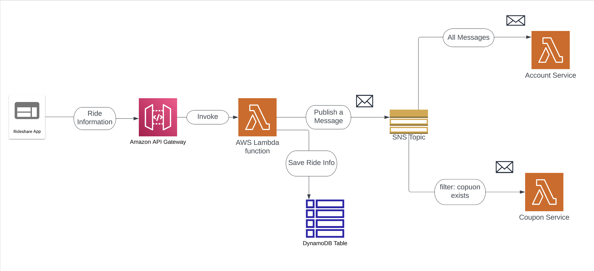

# Parallel Data Processing on AWS

- In this architecture, a backend application receives data through API calls and processes the data in parallel.

- The rideshare app sends ride information to the backend APIs. Amazon API Gateway receives the request and redirects it to an AWS Lambda function for processing.

- The request is processed by an AWS Lambda function that saves the data into an Amazon Dynamodb table. This action invokes a message to an Amazon SNS topic that contains the fields  "discount" and "coupon" that will be used for filtering.

- A Lambda fucntion for Account service is a subscriber to the SNS topic and will receive all messages sent to this topic, because a filter is not configured.

- A Lambda funciton for the Coupon service is another subscriber to the same SNS topic. The subscriber receives messages that contain the attribute "coupon".

